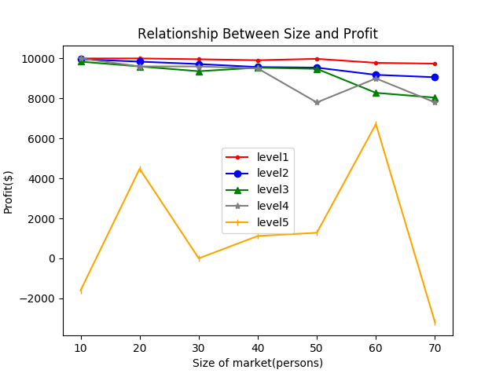
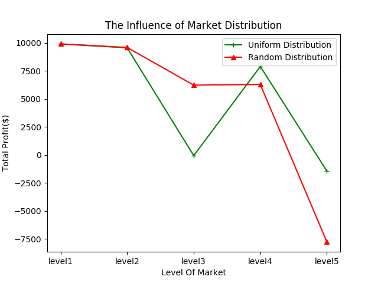

# Market Profit Simulation

### Team Member:
Yuqian Cao (NetID: yuqianc3) 

### Monte Carlo Simulation Scenario:
There are many factors may influence the profit of a supermarket. For instance, the pricing, location, customer volume, hiring cost. Suppose there is a company that wants to start a supermarket chain in a city and they have already known the resident’s income level. This simulation could be used to help them decide the size, price level, location and how many supermarkets to open in this city to maximize the profit.

### Preconditions: 
1. In my simulation, the map of a city is in a rectangular shape. User can input the city's rows and columns to create a city map. 
2. We assume that each element in the map array has a corresponding resident. The income level of each household is demonstrated by the value of the element.   
    0: Low income level household
    1: Average income level household
    2: High income level household
3. For each resident, they have a shopping budget which is related to their income. And for each market, it has a average selling price. Residents are willing to shop in the market only if the selling price is lower or equal to their budget.
4. For each resident, their maximum tolerance toward the distance to the market is determined by the size of the market. People can tolerate longer distance if the market has a larger size.
5. For each market, we will simulate the number of resident that are likely to purchase in their store, then compare with their size(which is also the capacity). I will choose the smaller one among this two value to calculate the estimate profit.

### Hypotheses: 

1. The best size and number of supermarkets to be started is related to the population and income level.
Randomized Variable: size of market; city income level; market level

2. Making the markets evenly distributed throughout the city is more profitable.
Randomized Variable: market level, Store distribution style

### Result & Conclution:
Hypothesis one:  

p1.1 Simulation Result for Low-income City
  

p1.2 Simulation Result for Average-income City

p1.3 Simulation Result for High-income City

According to the plot I generated, I noticed that the overall income level of the city do have influence on the profit. Generally speaking, the richer the city is, the more the total profit. 
For the richest city, we could see that almost all lines are approaching a profit of $10000(which is also the upper limitation for this simulation). The only exception is the yellow line, which represent the store with the highest selling price. Although the yellow line is unstable, in most cases, it's still above $0. Thus we may conclude that starting a market business in a wealthy city will bring the company the most profit and the least risk of deficit.
For the average city and low-income city, we may notice that the worse the finance status, the more unstable the profit line. We can also see that in both of these two kind of cities, running a expensive store will take a great risk of deficit. (In this simulation, the deficit floor is -$10000.) 

Hypothesis two:  
  

p2.1 Simulation Result for Market Distribution

For the second hypothesis, I generated two different kinds of store location criteria. For the uniform distribution style, the distance between every two nearest stores are the same. For the randomly distribution style, the distance between store and store can varies.
According our simulation result, these two kind of distribution style have a similar trend(decrease -> increase -> decrease). Sometimes the uniform distribution have a better performance sometimes the randomly distribution does better. When the level of market relatively low(level1 or level2), these two style almost have the same performance. This can be explained by, when the product price is relatively low, no matter where the store locates, residents who live near them will definitely willing to make some purchase, so the market can earn the max profit. 
